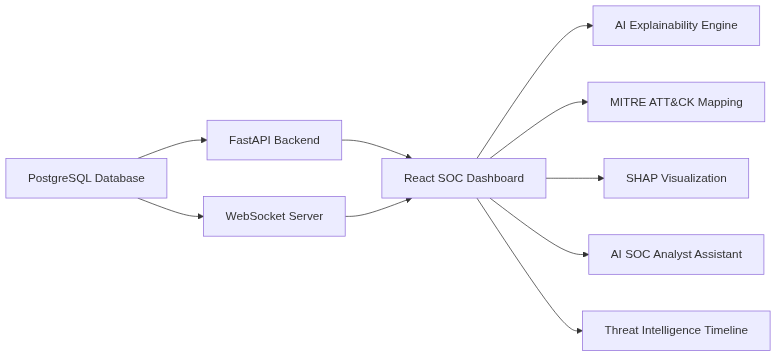
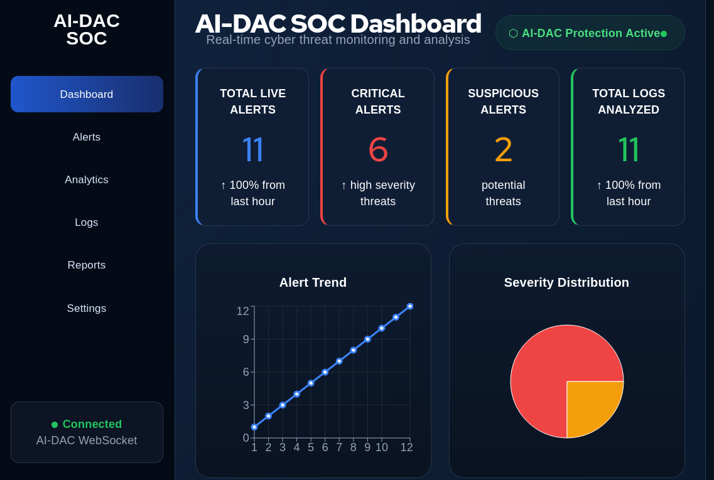
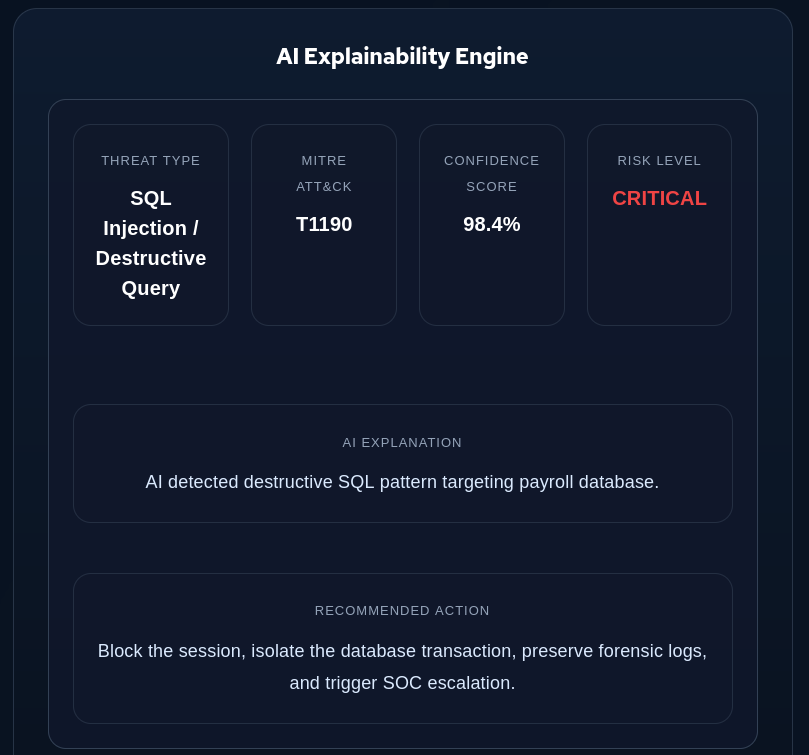
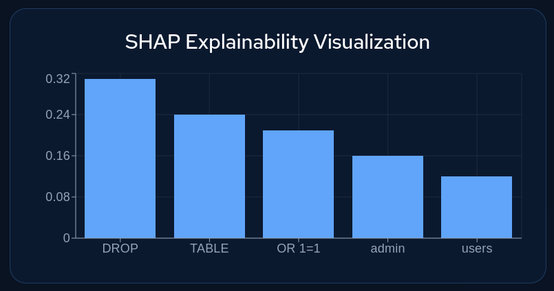
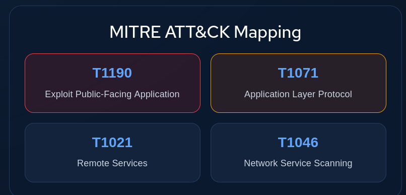
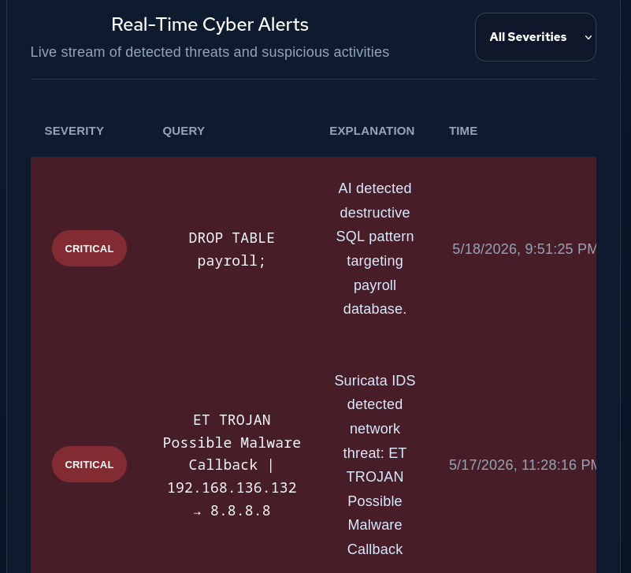

# AI-DAC SOC Dashboard

AI-DAC is an AI-driven SOC/XDR research platform for realtime cybersecurity monitoring, anomaly detection, explainability, and SOC analyst assistance.

## Overview

The platform demonstrates a complete AI-powered security operations workflow combining:

- realtime WebSocket alert streaming
- PostgreSQL-backed anomaly persistence
- FastAPI backend statistics
- React SOC dashboard
- AI Explainability Engine
- SHAP explainability visualization
- MITRE ATT&CK mapping
- AI SOC Analyst Assistant
- Threat Intelligence Timeline

---

## Architecture



---

## Dashboard Screenshots

### Dashboard Overview



### AI Explainability Engine



### SHAP Visualization



### MITRE ATT&CK Mapping



### Threat Intelligence Timeline



---

## Features

- Realtime WebSocket threat streaming
- PostgreSQL anomaly ingestion
- FastAPI backend API
- AI Explainability Engine
- SHAP-style visualization
- MITRE ATT&CK mapping
- AI SOC Analyst Assistant
- Threat Intelligence Timeline
- Audio alerting
- Enterprise SOC UI
- React + Recharts analytics

---

## Technology Stack

### Backend

- Python
- FastAPI
- PostgreSQL
- psycopg2
- WebSockets

### Frontend

- React
- Vite
- Recharts
- CSS enterprise SOC theme

### Security & AI

- anomaly detection
- explainability
- MITRE ATT&CK mapping
- SHAP visualization
- AI SOC assistant

---

## Running the Demo

See:

```text
docs/demo/AI-DAC_SOC_Demo_Script.md
